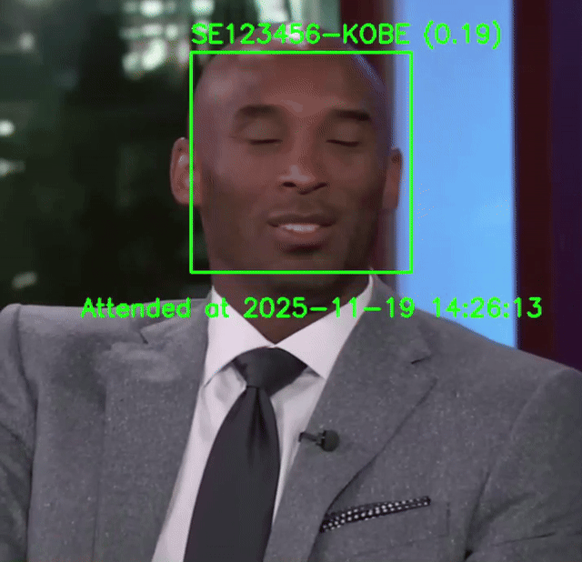

# 👋 Hi, I'm Ngo Hoai Nam (Hman)

### 🎓 AI Major at FPT University | 🔬 Researcher

  Passionate about leveraging <strong>Artificial Intelligence</strong> to build transparent, data-driven systems that make a tangible social impact. My journey spans across multiple domains, including <strong>computer vision</strong>, <strong>natural language processing</strong>, <strong>sound</strong>, and <strong>machine learning</strong>. Always learning. Always building.

  
  
  

---

## 🛠️ Technologies & Skills

  
  
  

  
  
  
  
  
  
  

  
  
  
  

  
  
  
  

  
  
  
  
  

  
  

  
  

  
  
  
  

  
  
  
  

---

## 🏆 Projects

<!-- ### 🏅 Achievements

| 🏆 **Competition/Award** | 📅 **Year** | 🥇 **Result** | 📋 **Description** |
|:----------------------:|:-----------:|:-------------:|:------------------:|
| **FPT University AI Competition** | 2024 | 🥈 2nd Place | Computer Vision Challenge |
| **National Programming Contest** | 2023 | 🥉 3rd Place | Algorithm & Data Structures |
| **Hackathon Innovation Prize** | 2024 | 🏆 Winner | Best AI Solution Award |
| **Academic Excellence** | 2023-2024 | 🎓 Honor Student | Top 5% in AI Major |

 -->

### 📂 Projects

#### 1) PPE DETECTION
- Repository: **[justHman/PPE_DETECTION](https://github.com/justHman/PPE_DETECTION)**
- Description: This project uses the **YOLOv8 model** to **detect protective gear** (e.g., helmets, vests, gloves) on workers.  
It combines detection results with a **safety-check algorithm** to determine whether a worker is **safe or unsafe**.  
A **user interface** is provided to make the system **interactive and easy to use**, allowing real-time monitoring and visualization of detection outcomes.

<!-- ##### Detection Classes

| Class ID | Name | Description |
|----------|------|-------------|
| 0 | worker | Person/worker in the scene |
| 1 | helmet | Safety helmet worn |
| 2 | vest | Safety vest worn |
| 3 | gloves | Safety gloves worn |
| 4 | boots | Safety boots worn |
| 5 | no_helmet | Helmet not detected |
| 6 | no_vest | Vest not detected |
| 7 | no_gloves | Gloves not detected |
| 8 | no_boots | Boots not detected |

##### Safety Classification Logic

A worker is classified as **SAFE** when:
- ✅ All selected PPE items are detected within the worker's bounding box
- ✅ None of the "no_*" items related to the required PPE are detected -->

**Demo:** Check to see if the worker is wearing a hat and vest?

#### 2) FACE RECOGNIZE
- Repository: **[justHman/PCA_FACE_RECOGNIZE](https://github.com/justHman/PCA_FACE_RECOGNIZE)**
- Description: A **real-time face recognition and attendance system** built using **OpenCV** and **Principal Component Analysis (PCA)**.  
This system can **collect face data**, **train recognition models**, and perform **real-time face recognition** for **attendance tracking** with automatic logging and high accuracy.

**Demo:**

#### 3) NATURAL SEARCH ENGINE
- Repository: **[justHman/VERTICAL_SEARCH_ENGINE](https://github.com/justHman/VERTICAL_SEARCH_ENGINE)**
- Description: This application **builds an inverted index** using **TF-IDF** and **FAISS** to perform **semantic search** on the **Natural Food** corpus with high speed (<1s). It provides a **friendly user interface** that allows users to **choose the search method**, integrates **spelling correction**, and displays results with **snippets** and **links** for clarity.

**Demo:**

#### 4) VIETNAMESE IMAGE CAPTIONING
- Repository: **[justHman/BLIP_VIETNAMESE_IMAGE_CAPTIONING](https://github.com/justHman/BLIP_VIETNAMESE_IMAGE_CAPTIONING)**
- Description: This project **fine-tunes image captioning** on two **Vietnamese datasets**: **KTVIC** and **UITVIC**.  
It includes both **unaccented (transfer-learning)** and **accented (train from scratch)** approaches, with text **tokenized using PhoBERT (VinAI)** to enhance Vietnamese language understanding and caption quality.

**Demo:**

- **Accented:** cầu thủ đánh bóng đang vung gậy để đánh bóng
- **Unaccented:** nguoi dan ong mac do trang dang choi bong chay tren san

---

## 📊 GitHub Stats

  
  
  

---

## 📬 Connect with Me

  
  
  

✨ Always open to **collaboration**, **research opportunities**, and **meaningful discussions**. 

 
---

**⭐ If you find my work interesting, don't forget to star my repositories! ⭐**

*Made with ❤️ by [justHman](https://github.com/justHman)*

